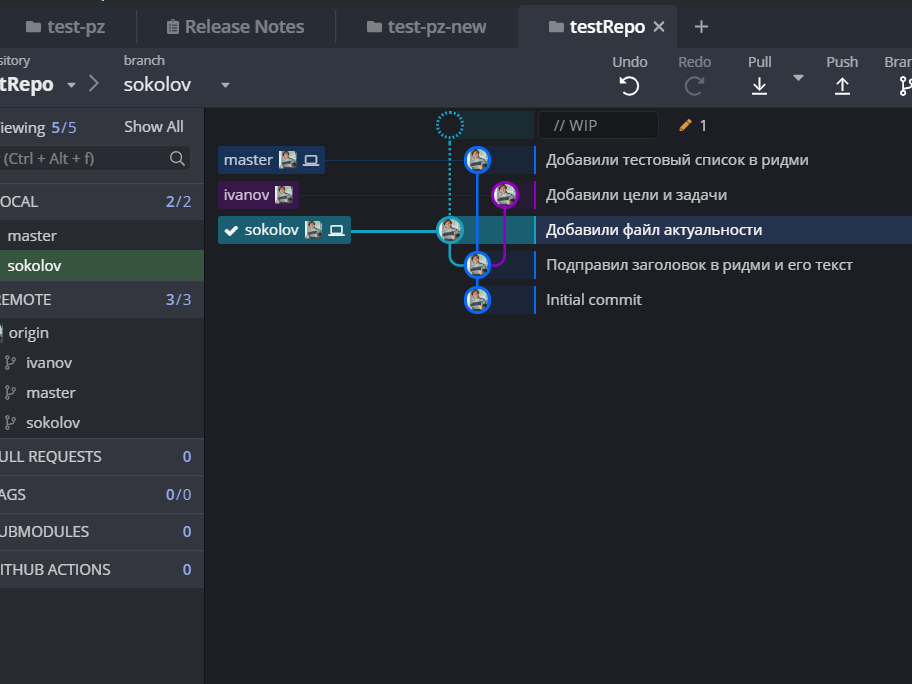

# Актуальность данной работы
Актуальность данной работы заключается в актуальной актуальности актуального акуализатора.

## Скриншот, показываюший всю актуальность наших актуальностей



```
var test = 0;

void Test() 
{

}
```